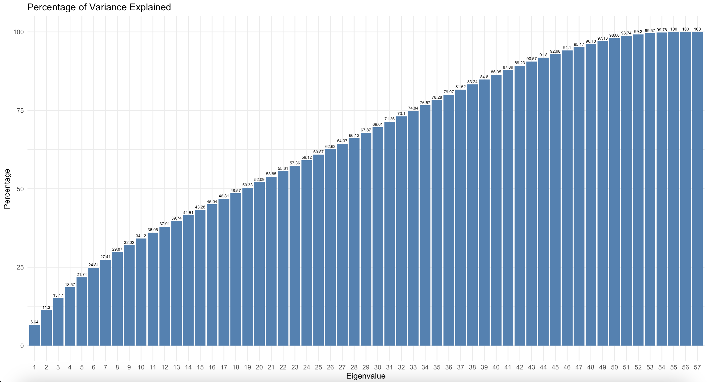

# [Group5] Porto Seguro's Safe Driver Prediction

Porto Seguro 為巴西最大的保險公司。我們將使用Porto Seguro提供的資料，預測客戶將會使用汽車保險的機率。

## Contributors

| 組員   | 系級     | 學號      | 工作分配                       |
|--------|----------|-----------|--------------------------------|
| 羅鈺涵 | 資科碩一 | 112753208 | 簡報製作                       |
| 陳品伃 | 資科碩一 | 112753204 | 程式撰寫、整理結果             |
| 郭彥伶 | 經濟碩二 | 110258015 | Readme撰寫、簡報調整、上台報告 |
| 巫謹任 | 資科碩一 | 111753124 | shinyapp製作                   |
| 許軒祥 | 資科碩一 | 111753122 | 程式撰寫                       |

## Demo

### Commends to reproduce our analysis

-   With PCA

``` r
Rscript code/FinalProject.R --train data/train.csv.zip --output results/result.csv --pca yes
```

-   Without PCA

``` r
Rscript code/FinalProject.R --train data/train.csv.zip --output results/result.csv --pca no
```

Running either command will output 1 csv file (result.csv).

### ShinyApps link: [<https://chingren.shinyapps.io/group5_final_project/>]

## Folder organization and its related description

### docs

-   Our presentation, 1112_DS-FP_groupID.ppt/pptx/pdf (i.e.,1112_DS-FP_group1.ppt), by **06.08**

### Data Introduction and Preprocessing

-   資料簡介:

    -   由Porto Seguro提供，共58個變數、595,212筆資料。
    -   變數依照特性區分為四大類別，分別為駕駛相關變數(Ind)、地區相關變數(reg)、車子相關變數(car)及計數相關變數(calc)。
    -   共有17個二元變數(binary variable)、14個類別變數(categorical variable)，其餘則為連續變數(continuous variable)或順序變數(ordinal variable)。

-   EDA

    -   檢視變數是否存在缺失值(NAs):

        

        由圖表可以觀察，資料中共13個變數包含缺失值，其中以 ps_car_03_cat 及 ps_car_05_cat 的缺失值最多。

    -   計算變數之間的相關性: (處理缺失值前)

        

        由上圖可觀察到以下兩個特徵:

        -   整體而言，相同類別的變數具有一定程度的相關性。
        -   計數相關變數(calc)彼此之間的相關性為0。

-   缺失值處理方法

    -   類別變數的缺失值以眾數替代；其餘變數(連續變數、順序變數與二元變數)的缺失值則以平均數替代。

    -   檢視處理缺失值後的變數相關性:

        

        可以發現處理缺失值後不影響變數間的相關性。

    -   檢視目標變數的分布情況:

        

        目標變數為 0 代表沒有使用保險的客戶；目標變數為 1 代表有使用保險的客戶。從上圖可觀察，目標變數存在明顯的資料不平衡問題，沒有使用保險的客戶與有使用保險的客戶的比值約為 26 : 1。

-   資料不平衡處理方法

    -   使用oversampling的方法，將訓練資料中的目標變數分布調整為 4 : 1。

``` r
library(ROSE)
X_train <- ovun.sample(target~., data = X_train, method = "over", p = 0.2)$data
table(X_train$target)
```

-   變數處理方法

    -   方法一: 使用PCA萃取前47個共同因子進行後續分析。如下圖所示，前47個共同因子約能解釋95.17%的變異 。

    -   方法二: 不使用PCA，僅將變數進行標準化(scaling)。

``` r
scale_df <- df %>%
  select(-target) %>%
  scale()
scale_df <- as.data.frame(scale_df)

new_df <- df %>%
  select(target) 
new_df <- cbind(new_df, scale_df)
```

### Model and Evaluation Method

-   模型介紹:

    -   XGBoost

        -   使用梯度演算法，透過連續迭代的方法逐步改善模型的預測能力。
        -   重要參數: 迭代次數 (nrounds)。
            -   nrounds愈大，表示模型將進行更多次迭代，能更充分學習數據的模式與特徵。然而，過大的nrounds值可能導致過擬合的問題，因此訓練過程中需謹慎選擇適當的nrounds值。

    -   Naive Bayes

        -   以貝式定理 (Bayes' theorem) 為基礎，在各事件獨立的假設下計算事件發生的條件機率。

    -   Logistic Regression

        -   又稱迴歸的線性分類器。其做法為嘗試找出一條直線，能將所有數據清楚分類。

    -   Null Model

        -   將目標變數的進行隨機排序，並使用 XGBoost 訓練模型，即為本研究的Null Model。

-   評估指標

    -   Normalized Gini Coefficient (標準化吉尼係數)

        -   標準化吉尼係數為 AUC 的線性組合。兩者之間的關係為: Gini = 2 × AUC − 1

        -   當標準化吉尼係數為1時，表示模型的預測結果完美區分positive case 與negative case；當標準化吉尼係數為0時，表示模型的預測結果與隨機猜測的效果相同；當標準化基尼係數為負數時，表示模型的預測結果比隨機猜測的效果還差。

    -   Precision (精確性)

    -   Sensitivity (敏感性)

    -   Specificity (特異性)

### Analysis steps

-   分析步驟:

    -   step1: 將處理缺失值後的原始資料以 8 : 2 的比例切分為 training data 及 testing data。

    -   step2: 以 oversampling 的方法將 training data 中目標變數的分布調整為 4 : 1 。

    -   step3: 使用 PCA 或 scaling 的方法處理 training data 及 testing data 的變數。

    -   step4: 使用 XGBoost、Naive Bayes、 Logistic、Null model 等方法訓練模型。其中，XGBoost 使用 test data 計算不同 nrounds 之下的 Normalized Gini Coefficient 進行最適模型選擇。

    -   step5: 計算各評估指標，比較不同模型的分類表現。

### Codes

**Model 1 : XGBoost**

-   設定相關參數。使用迴圈訓練不同 nrounds 之下的XGBoost模型，並利用 testing data 計算不同 nrounds 之下的 Normalized Gini Coefficient。

``` r
print("Start XGBoost...")
params <- list(
  objective = "binary:logistic",
  eval_metric = "logloss"
)

xgb_list <- list()
nrounds_list<-list()
i=10
while (i != 50){
  print(i)
  xgb_model <- xgboost(data = as.matrix(X_train[-1]),
                       label = X_train$target,
                       params = params,
                       nrounds = i)
  nrounds_list <- append(nrounds_list, i)
  xgb_pred <- predict(xgb_model, newdata = as.matrix(X_test[-1]))
  print(paste("XGBoost: ", normalizedGini(X_test$target, xgb_pred)))
  xgb_list <- append(xgb_list, round(normalizedGini(X_test$target, xgb_pred),3))
  i <- i+10
}
```

-   將不同 nrounds 之下的 Normalized Gini Coefficient 以圖形表示:

``` r
# plot the gini grade of parameters
xgb_data <- data.frame(parameters = unlist(nrounds_list), xgb_list = unlist(xgb_list))
ggplot(xgb_data, aes(x = parameters, y = xgb_list)) +
  geom_line(color = "lightblue", linewidth = 1) +  # 設定折線顏色和粗細
  geom_text(aes(label = xgb_list), vjust = -1.5, color = "darkblue", size = 4) +
  labs(x = "NRounds", y = "Gini", title = "XGBoost Model Training") +
  theme_minimal() +                         # 使用簡約風格的主題
  theme(plot.title = element_text(size = 12, face = "bold"),  # 設定標題樣式
        axis.text = element_text(size = 10),                  # 設定軸標籤樣式
        axis.title = element_text(size = 10, face = "bold"))  # 設定軸標籤樣式
```

-   圖形一 : 有做 PCA


-   圖形二: 沒有做 PCA (只做scaling)


-   選定最佳 nrounds 訓練 XGBoost 模型

``` r
### XGBoost Select Best N Rounds
best_nrounds <- as.numeric(nrounds_list[which.max(xgb_list)])
xgb_model <- xgboost(data = as.matrix(X_train[-1]),
                 label = X_train$target,
                 params = params,
                 nrounds = best_nrounds)
xgb_pred <- predict(xgb_model, newdata = as.matrix(X_test[-1]))
```

**Model 2 : Naive Bayes**

-   訓練 Naive Bayes 模型，以testing data進行預測。

``` r
nb_model <- naiveBayes(target ~ ., data = X_train)
nb_pred <- predict(nb_model, newdata = X_test[-1], type = 'raw')
```

**Model 3 : Logistic Regression**

-   訓練 Logistic Regression 模型，以testing data進行預測。

``` r
logistic_model <- glm(target ~ ., 
                      data = X_train, 
                      family = binomial)
logistic_pred <- predict(logistic_model, newdata = X_test[-1])
```

**Model 4 : Null Model**

-   訓練 Null Model，以testing data進行預測。

``` r
shuffle_X_train <- X_train
shuffle_X_train$target <- sample(shuffle_X_train$target)
null_model <- xgboost(data = as.matrix(shuffle_X_train[-1]),
                     label = shuffle_X_train$target,
                     params = params,
                     nrounds = best_nrounds)
null_pred <- predict(null_model, newdata = as.matrix(X_test[-1]))
```

### Results

我們以客戶將會使用保單的情況 (target = 1) 設定為 Positive case ，計算以下各指標:

-   With PCA

| Model       | Gini  | Precision | Sensitivity | Specificity |
|-------------|-------|-----------|-------------|-------------|
| XGBoost     | 0.221 | 0.585     | 0.050       | 0.974       |
| Naive Bayes | 0.209 | 0.513     | 0.051       | 0.972       |
| Logistic    | 0.231 | 0.536     | 0.053       | 0.973       |
| Null        | 0.004 | 0.813     | 0.036       | 0.961       |

-   Without PCA

| Model       | Gini   | Precision | Sensitivity | Specificity |
|-------------|--------|-----------|-------------|-------------|
| XGBoost     | 0.268  | 0.622     | 0.052       | 0.976       |
| Naive Bayes | 0.214  | 0.510     | 0.052       | 0.972       |
| Logistic    | 0.235  | 0.571     | 0.051       | 0.974       |
| Null        | -0.553 | 0.672     | 0.034       | 0.960       |

### Conclusions

-   整體而言，無論是否有進行PCA，Sensitivity 與 Specificity 的差距都相當懸殊，且各模型的 Precision 與Null Model 差異不大，約落在0.5\~0.6之間。表示即使我們已經處理資料不平衡的問題，模型依舊難以識別資料中的 Positive case ，也難以提升分類的精確度。

-   可以觀察進行PCA並不能提升模型的預測能力。以 Gini 來看，甚至不做PCA的預測能力可能更好。可能的原因是資料本身的包含過多雜訊 ( 例如: 抽樣誤差、遺漏重要變數等 )，導致 PCA 難以萃出取具有解釋力的因子，降低模型的預測能力。

-   可以改進的方向: 在建立模型之前，可以先分析各變數與目標變數的關係，盡量刪除相關性較低的變數，減少資料中的雜訊。

### Reference

-   Packages we use

``` r
library(ggplot2)
library(dplyr)
library(ROSE)
library(corrplot)
library(caTools)
library(xgboost)
library(e1071)
library(pROC)
library(factoextra)
library(caret)
```

-   Related publications
